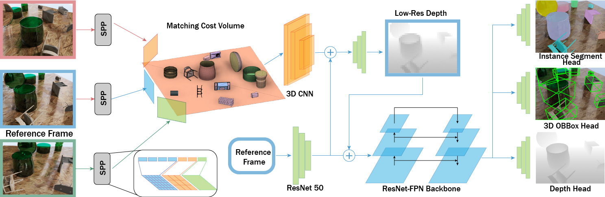

## MVTrans: Multi-view Perception to See Transparent Objects (ICRA2023)

[**Paper**](https://arxiv.org/abs/2302.11683) | [**Project**](https://ac-rad.github.io/MVTrans/) | [**Video**](https://youtu.be/8Qdc_xWVp-k)

This repo contains the official implementation of the paper "MVTrans: Multi-view Perception to See Transparent Objects". 

## Introduction
Transparent object perception is a crucial skill for applications such as robot manipulation in household and laboratory settings. Existing methods utilize RGB-D or stereo inputs to handle a subset of perception tasks including depth and pose estimation. However transparent object perception remains to be an open problem. In this paper, we forgo the unreliable depth map from RGB-D sensors and extend the stereo based method. Our proposed method, MVTrans, is an end-to-end multi-view architecture with multiple perception capabilities, including depth estimation, segmentation, and pose estimation. Additionally, we establish a novel procedural photo-realistic dataset generation pipeline and create a large-scale transparent object detection dataset, Syn-TODD, which is suitable for training networks with all three modalities, RGB-D, stereo and multi-view RGB.



## Installation
Setup a conda environment, install required packages, and download the repo:
``` 
conda create -y --prefix ./env python=3.8
./env/bin/python -m pip install -r requirements.txt
git clone https://github.com/ac-rad/MVTrans.git
```
Weights & Biases (wandb) is used to log and visualize training results. Please follow the [instruction](https://docs.wandb.ai/) to setup wandb. To appropriately log results to cloud, insert your wandb login key in `net_train_multiview.py`. Otherwise, to log results locally, run the following command and access results at localhost:
```
wandb offline
```

## Dataset
Our synthetic transparent object detection dataset (Syn-TODD) can be downloaded at [here](https://borealisdata.ca/dataset.xhtml?persistentId=doi:10.5683/SP3/LQKTXE). 

## Pre-trained Model

We provide pre-trained model weight for MVTrans trained on Syn-TODD dataset.

| Model views | Link |
|-------------|------|
| 2 views     |  [here](https://borealisdata.ca/api/access/datafile/632196)    |
| 3 views     |  [here](https://borealisdata.ca/api/access/datafile/632197)    |
| 5 views     |  [here](https://borealisdata.ca/api/access/datafile/632195)    |

## Training
To train MVTrans from scratch, modify the data path and output directory in configuration files under `config/`, and then run:
```
./runner.sh net_train_multiview.py @config/net_config_blender_multiview_{NUM_OF_VIEW}_train.txt
```

## Evaluation
To run the evaluation, need to change modify the data path and output directory in configuration files under `config/`, and then run:
```
./runner.sh net_train_multiview.py @config/net_config_blender_multiview_{NUM_OF_VIEW}_eval.txt
```
## Inference
To run the inference, launch jupyter notebook and run `inference.ipynb`.
## Citation
Please cite our paper:
```
@misc{wang2023mvtrans,
      title={MVTrans: Multi-View Perception of Transparent Objects}, 
      author={Yi Ru Wang and Yuchi Zhao and Haoping Xu and Saggi Eppel and Alan Aspuru-Guzik and Florian Shkurti and Animesh Garg},
      year={2023},
      eprint={2302.11683},
      archivePrefix={arXiv},
      primaryClass={cs.RO}
}
```

## Reference
Our MVTrans architecture is built based on [SimNet](https://github.com/ToyotaResearchInstitute/simnet) and [ESTDepth](https://github.com/xxlong0/ESTDepth).
